# AKS CNI Overlay Public Cluster with Custom Virtual Network

## Description
Learn about AKS CNI Overlay Public Clusters with a Custom Virtual Network.  Learn what goes into planning a CNI Overlay Cluster, what the configuration looks like, and use my Azure CLI Scrapbook to deploy.  A public AKS Cluster is where the API Server is reachable via the internet. 

## Downloadable Lab Files
- net01-cni-overlay-public-cluster-custom-vnet.azcli
- aks-store-quickstart.yaml

## Introduction
A CNI Overlay Cluster uses a NAT Overlay network that has been integrated into Azure's Software Defined Network.  The legacy kubenet technology required the use of Route Tables and User Defined Routes (UDRs) to allow the pods/Nodes to be able to talk to each other.  Due to the integration of the overlay with CNI Overlay into the Azure Software Defined Network, Route Tables and UDRs are not required for CNI Overlay.

In CNI Overlay, we have three Network Prefixes to specify (can omitt for default values which I will discuss):
* Pod CIDR - This is the NAT Range that Pods will use on your CNI Overlay AKS Cluster.  Because this is a NAT Range, communication from outside of the cluster directly to a pod will not be possible. 
* Service CIDR - A range of IP addresses that Kubernetes uses to assign virtual IPs to services inside the cluster, enabling stable internal networking for pods to communicate with services.  This CIDR range must be smaller than /12. 
* DNS Service IP - The AKS DNS Service IP is an IP address used by Kubernetes' built-in DNS service (CoreDNS) to provide service discovery within a cluster. This IP is taken from the cluster's Kubernetes service address range and is used by pods to resolve the names of other services and endpoints within the cluster to their correct IP addresses. 

    Do NOT use the first IP address in your address range. The first address in your subnet range is used for the kubernetes.default.svc.cluster.local address

The following are some other general guidelines regarding AKS Public CNI Overlay Clusters that use Managed Virtual Networks:
 
 * CNI Overlay supports 5000 nodes and 250 pods/node.  Both the default and maximum are both 250 pods per node.
 * During AKS Deployment, you specify a POD CIDR.  Every deployment will carve out a /24 subnet from that POD CIDR specified during deployment.  This is depicted in the CNI Overlay diagram below where each node has a separate Pod CIDR (10.10.1.0/24 and 10.10.2.0/24).  Because of this, you'll need to do some network planning to determine how many nodes you want your CNI Overlay Cluster to scale to and ensure your Pod CIDR Range specified at deployment is large enough to provide enough /24 for all your nodes during normal operations, scale events, and upgrade surging (1 node by default). 
    
    * --max-pods does allow you to restrict the maximum amount of pods on a node. This is possible on new clusters/node pools only.  For an existing cluster, you would need to create a new node pool, migrate pods to the new nodepool, and once complete, delete your old nodepool. 

* If you leave Pod CIDR, Service CIDR, and DNS Service IP blank, the following values are used:

    * Pod CIDR: 10.244.0.0/16
    * Service CIDR: 10.0.0/16
    * DNS Service IP: 10.0.0.10/32

    > **Note**: As we will be using a custom Virtual Network, we will be specifying the network prefixes we want for each. We will use the defaults but within our own virtual network.

* If you leave the AKS Cluster to create and manage the Virtual Network (which is not one of the goals of this articles), the following Virtual Network Address Space and Node Subnet are used:

    * Virtual Network Address Space: 10.224.0.0/12
    * Node Subnet (aks-subnet): 10.224.0.0/16

    > **Note**: As we will be using a custom Virtual Network, we will be specifying the network prefixes we want for each. We will use the defaults but within our own virtual network.


I would recommend reading the following articles which discuss more of the above:
    
* [Azure Container Networking Interface (CNI) Overlay networking](https://learn.microsoft.com/en-us/azure/aks/concepts-network-azure-cni-overlay)

* [Configure Azure CNI Overlay networking in Azure Kubernetes Service (AKS)](https://learn.microsoft.com/en-us/azure/aks/azure-cni-overlay?tabs=kubectl)

* [Azure Kubernetes Service (AKS) CNI networking overview](https://learn.microsoft.com/en-us/azure/aks/concepts-network-cni-overview)

* [Networking concepts for applications in Azure Kubernetes Service (AKS)](https://learn.microsoft.com/en-us/azure/aks/concepts-network) 

* [IP address planning for your Azure Kubernetes Service (AKS) clusters](https://learn.microsoft.com/en-us/azure/aks/concepts-network-ip-address-planning)

## Deployment
1. Download net01-cni-overlay-public-cluster-custom-vnet.azcli

2. Login to Azure using the Azure CLI in your Shell of choice.  Download Azure CLI here: [How to install the Azure CLI](https://learn.microsoft.com/en-us/cli/azure/install-azure-cli?view=azure-cli-latest)

3. Execute the commands in the script.

    #### Deploy Variables

    

    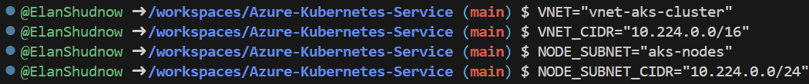

    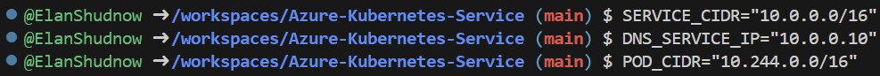

    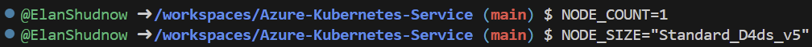

    #### Create Resource Group

    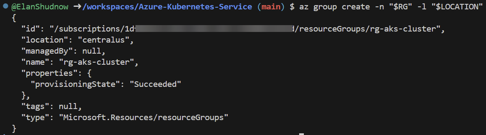

    #### Create Virtual Network/Subnet

    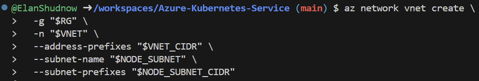

    #### Capture Node Subnet ID for AKS Nodes to be deployed within

    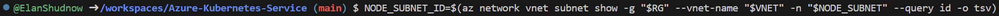

    #### Deploy AKS Cluster

    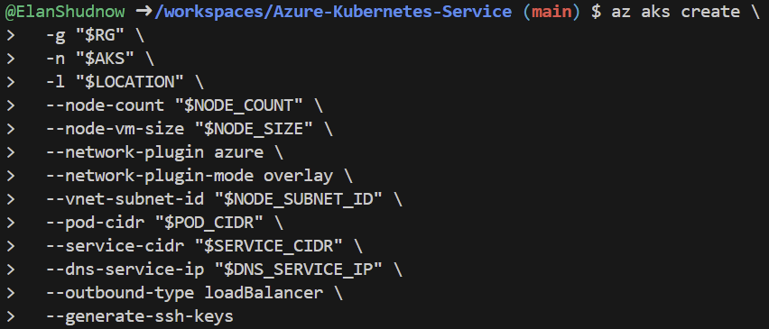

    #### Connect to AKS Cluster

    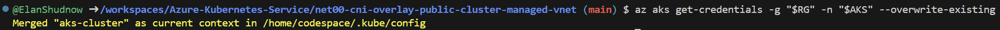


## Deployment Validation

We deployed our cluster with a Custom Virtual Network and also by specifying Pod Cidr, Service Cidr, or DNS Service IP even though the network prefixes we used are the same network prefixes used if you were to use a Managed Virtual Network.  Let's confirm our cluster is deployed with the values we mentioned above.  First, let's take a look at the JSON View of the AKS Cluster in the Azure Portal.

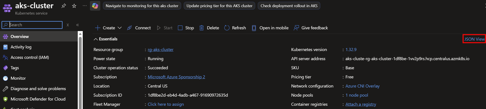

Within the JSON view, validate the Pod CIDR, Service CIDR, and DNS Service IP match the 3 network prefixes mentioned earlier:

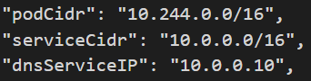

Looking at the Virtual Network in the portal, we can see the Virtual Network was deployed with 10.224.0.0/16

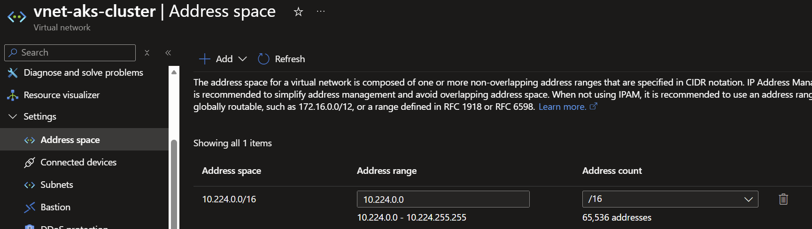

We also see the subnet, aks-nodes, was deployed with 10.224.0.0/24


> **Note**: As can you see, a Network Security Group (NSG) is not created and assigned to the aks-nodes subnet.  If you wish to create a NSG and attach it to your aks-nodes subnet, please follow guidance in the AKS Documentation: [Network Security Groups](https://learn.microsoft.com/en-us/azure/aks/concepts-network#network-security-groups)

Looking at connected devices, we will see our AKS Node (we only deployed 1 node) is connected to the Virtual Network within the aks-nodes subnet.

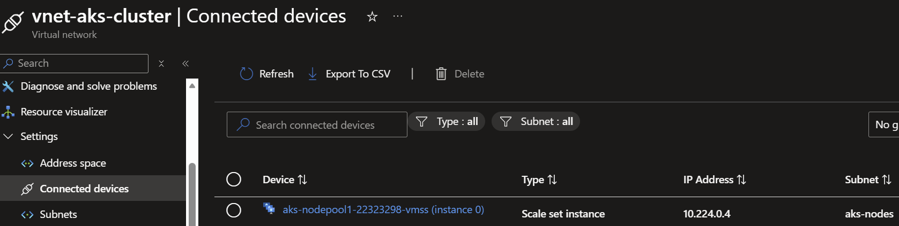


Let's run the following kubectl get to see our nodes (we specified only one) and its Private IP Address, whcih should fall within the 10.224.0.0/16 subnet as mentioned in the Introduction section.

```
kubectl get nodes -o wide
```

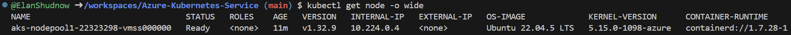


Let's download a [Quickstart Sample](https://learn.microsoft.com/en-us/azure/aks/learn/quick-kubernetes-deploy-cli) from the Azure Learn Documentation. I have included a downloadable yaml for this here in this GitHub folder. This Quickstart includes pods and services so we can validate the IP Addresses used for both.  

Run the following command to deploy the Quickstart YAML:

```
kubectl apply -f aks-store-quickstart.yaml
```

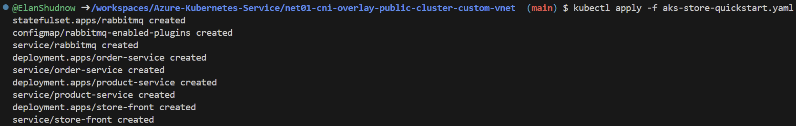

If we run the following command, it will allow us to validate our services and their Private IPs (Cluster IP) and we can validate the service is using an IP Address in our Service CIDR Range of 10.0.0/16

```
kubectl get service
```

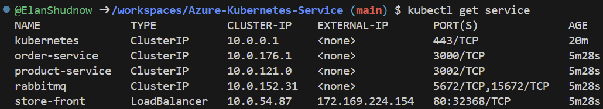

If we run the following command, it will allow us to validate our pods and their Private IPs belong to the Pod CIDR Network Prefix Range of 10.244.0.0/16

```
kubectl get pod -o wide
```

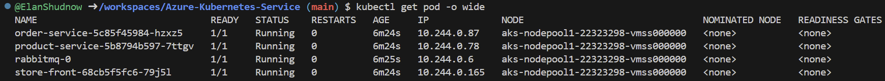

It was mentioned in the introduction that for a CNI Overlay Cluster, each node carves out a /24 network prefix for the Pod CIDR which is why each node is allowed to support a max amount of 250 pods per node.  We just validated that the pods are all running on 10.244 which is part of the Pod CIDR Network Prefix.  But if you'd like to see what /24 Pod CIDR Prefix it has been carved out, you can run the following command:

Single Node (specify `<node name>`):
```
kubectl -n kube-system get nnc <node name> -o jsonpath='{.metadata.name}{" -> PrimaryIP: "}{.status.networkContainers[0].primaryIP}{" | Subnet: "}{.status.networkContainers[0].subnetAddressSpace}{"\n"}'
```

All Nodes (exclude `<node name>`):
```
kubectl -n kube-system get nnc -o jsonpath='{range .items[*]}{.metadata.name}{"\t"}{.status.networkContainers[0].primaryIP}{"\t"}{.status.networkContainers[0].subnetAddressSpace}{"\n"}{end}'
```

After running the command, the network prefix returned (PrimaryIP) is the /24 used by that node that falls within the Subnet field which is the entire Pod CIDR Network Prefix.

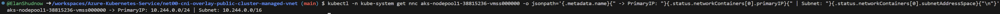

