# AKS CNI Overlay Private Cluster with Custom Virtual Network and System Private Endpoint

## Description
Learn about AKS CNI Overlay Private Clusters with an AKS Custom Virtual Network. The Private Endpoint will be leveraging system mode in which the AKS Cluster will manage the Private DNS Zone and Private Endpoint. Learn what goes into planning a CNI Overlay Cluster, what the configuration looks like, and how Private DNS Connectivity using a managed Private DNS Zone functions all deployable via my Azure CLI Scrapbook.  A private AKS Cluster is where the API Server is unreachable via the internet and without [API Server VNET Integration](https://learn.microsoft.com/en-us/azure/aks/api-server-vnet-integration), is only reachable via Private Endpoints / Private DNS Zones. 

## Downloadable Lab Files
- net03-cni-overlay-private-cluster-custom-vnet-system-pe.azcli
- aks-store-quickstart.yaml

## Introduction
A CNI Overlay Cluster uses a NAT Overlay network that has been integrated into Azure's Software Defined Network.  The legacy kubenet technology required the use of Route Tables and User Defined Routes (UDRs) to allow the pods/Nodes to be able to talk to each other.  Due to the integration of the overlay with CNI Overlay into the Azure Software Defined Network, Route Tables and UDRs are not required for CNI Overlay.

In CNI Overlay, we have three Network Prefixes to specify (can omitt for default values which I will discuss):
* Pod CIDR - This is the NAT Range that Pods will use on your CNI Overlay AKS Cluster.  Because this is a NAT Range, communication from outside of the cluster directly to a pod will not be possible. 
* Service CIDR - A range of IP addresses that Kubernetes uses to assign virtual IPs to services inside the cluster, enabling stable internal networking for pods to communicate with services.  This CIDR range must be smaller than /12. 
* DNS Service IP - The AKS DNS Service IP is an IP address used by Kubernetes' built-in DNS service (CoreDNS) to provide service discovery within a cluster. This IP is taken from the cluster's Kubernetes service address range and is used by pods to resolve the names of other services and endpoints within the cluster to their correct IP addresses. 

    Do NOT use the first IP address in your address range. The first address in your subnet range is used for the kubernetes.default.svc.cluster.local address

The following are some other general guidelines regarding AKS Public CNI Overlay Clusters that use Managed Virtual Networks:
 
 * CNI Overlay supports 5000 nodes and 250 pods/node.  Both the default and maximum are both 250 pods per node.
 * During AKS Deployment, you specify a POD CIDR.  Every deployment will carve out a /24 subnet from that POD CIDR specified during deployment.  This is depicted in the CNI Overlay diagram below where each node has a separate Pod CIDR (10.10.1.0/24 and 10.10.2.0/24).  Because of this, you'll need to do some network planning to determine how many nodes you want your CNI Overlay Cluster to scale to and ensure your Pod CIDR Range specified at deployment is large enough to provide enough /24 for all your nodes during normal operations, scale events, and upgrade surging (1 node by default). 
    
    * --max-pods does allow you to restrict the maximum amount of pods on a node. This is possible on new clusters/node pools only.  For an existing cluster, you would need to create a new node pool, migrate pods to the new nodepool, and once complete, delete your old nodepool. 

* If you leave Pod CIDR, Service CIDR, and DNS Service IP blank, the following values are used:

    * Pod CIDR: 10.244.0.0/16
    * Service CIDR: 10.0.0/16
    * DNS Service IP: 10.0.0.10/32 

    > **Note**: As we will be using a custom Virtual Network, we will be specifying the network prefixes we want for each. We will use the defaults but within our own virtual network.

* If you leave the AKS Cluster to create and manage the Virtual Network (in this article, we're using a custom VNET), the following Virtual Network Address Space and Node Subnet are used:

    * Virtual Network Address Space: 10.224.0.0/12
    * Node Subnet (aks-subnet): 10.224.0.0/16

    > **Note**: As we will be using a custom Virtual Network, we will be specifying the network prefixes we want for each. We will use the defaults but within our own virtual network.

* The Private Endpoint created will leverage the same subnet the AKS Nodes use.  Thefore, it takes away an available IP Address that would otherwise be used for an additional node.  This should be accounted for in the amount of nodes your cluster can scale to. Typically, with CNI Overlay, a /24 subnet can fit up to 251 nodes since the first three IP addresses are reserved for management tasks.  Because the Private Endpoint will consume an IP Address in the same subnet as Nodes, you will instead be able to scale up to 250 nodes.


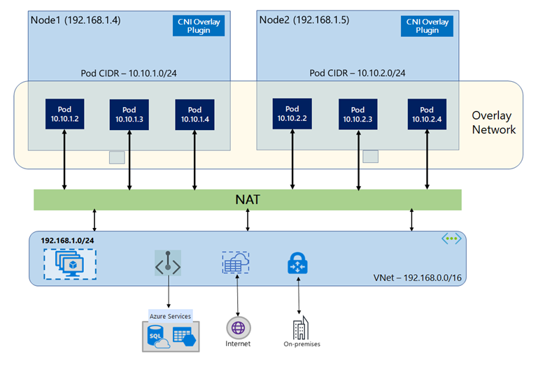

I would recommend reading the following articles which discuss more of the above:
    
* [Azure Container Networking Interface (CNI) Overlay networking](https://learn.microsoft.com/en-us/azure/aks/concepts-network-azure-cni-overlay)

* [Configure Azure CNI Overlay networking in Azure Kubernetes Service (AKS)](https://learn.microsoft.com/en-us/azure/aks/azure-cni-overlay?tabs=kubectl)

* [Azure Kubernetes Service (AKS) CNI networking overview](https://learn.microsoft.com/en-us/azure/aks/concepts-network-cni-overview)

* [Networking concepts for applications in Azure Kubernetes Service (AKS)](https://learn.microsoft.com/en-us/azure/aks/concepts-network) 

* [IP address planning for your Azure Kubernetes Service (AKS) clusters](https://learn.microsoft.com/en-us/azure/aks/concepts-network-ip-address-planning)

## Private API Server with Custom VNET
Regarding Private API Servers, kubectl leverages the API Server in order to execute commands.  In a Public API Server configuration, the API Server is reachable over the internet and all kubectl commands are executed over the internet to the API Server's public IP Address.

When leveraging the --enable-private-cluster parameter during AKS Deployment while also specifying custom Virtual Network settings or Private DNS Zone configurations (which we'll be doing in this article), a custom Virtual Network that is specified during az aks create will be leveraged.  As we'll be using a system-managed AKS Private DNS Zone, Private Endpoint, and Network Interface Card (NIC), we will allow the AKS Cluster decide where specifically to place the Private Endpoint.  We will see how this works later in this article.

During our Deployment Validation section below, we'll take a look at how we can connect to our Private API Server and how the Private DNS Zone and Private Endpoint all work together to allow connectivity to our API Server.

> **Note**: An AKS Cluster configured with a Private API Server (--enable-private-cluster) does not prevent public inbound nor outbound access for our applications.  An AKS Cluster configured with a Private API Server only means the API Server itself is private.

## Deployment
1. Download net03-cni-overlay-private-cluster-custom-vnet-system-pe.azcli

2. Login to Azure using the Azure CLI in your Shell of choice.  Download Azure CLI here: [How to install the Azure CLI](https://learn.microsoft.com/en-us/cli/azure/install-azure-cli?view=azure-cli-latest)

3. Execute the commands in the script.

    #### Deploy Variables

    

    

    

    

    #### Create Resource Group

    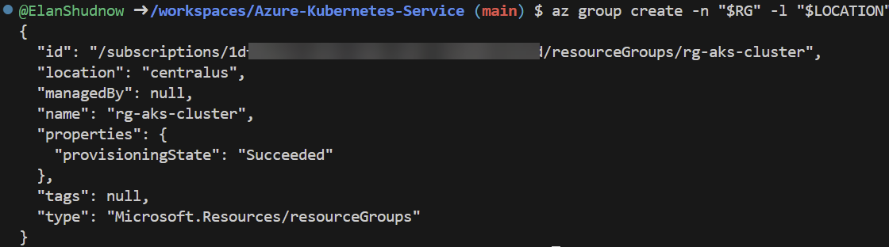

    #### Create Virtual Network/Subnet

    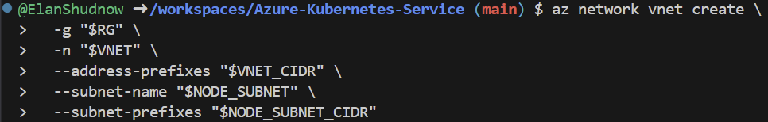

    #### Capture Node Subnet ID for AKS Nodes to be deployed within

    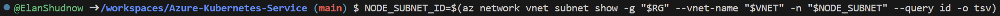

    #### Deploy AKS Cluster

    

    #### Connect to AKS Cluster

    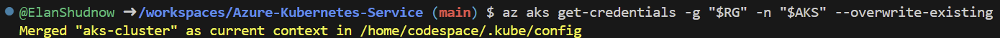


## Deployment Validation

We deployed our cluster without specifying Pod Cidr, Service Cidr, or DNS Service IP.  Let's confirm our cluster is deployed with the default values we mentioned above.  First, let's take a look at the JSON View of the AKS Cluster in the Azure Portal.


Within the JSON view, validate the Pod CIDR, Service CIDR, and DNS Service IP match the 3 network prefixes mentioned earlier:

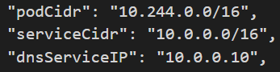

Let's run the following kubectl get to see our nodes (we specified only one) and its Private IP Address, whcih should fall within the 10.224.0.0/16 subnet as mentioned in the Introduction section.

``` bash
kubectl get nodes -o wide
```


This is new... We're getting a failure running kubectl commands.  But why?  This is where API Servers being deployed privately becomes different than public clusters.  Kubectl is a command that connects to the API Server in order to run commands.  The machine I am running kubectl from has no access to talk to the API Server. 

See the official documentation that provides [Options for connecting to the private cluster](https://learn.microsoft.com/en-us/azure/aks/private-clusters?tabs=default-basic-networking%2Cportal%2Cazure-portal#options-for-connecting-to-the-private-cluster). These options vary from connecting from a VM deployed in the AKS VNET, a peered VNET, a network that is connected to the AKS VNET through ExpressRoute, Site to Site VPN, or even leveraging Bastion.  

For purposes of this lab, I am going to create another subnet in the AKS Customer VNET and deploy a Virtual Machine into this subnet called AKSPrivVM.  I will not demonstrate these steps as it is outside of the scope of this article.

From this VM, we'll need to install kubectl and Azure CLI Tools and login via Azure CLI using instructions provided [Install Kubctl](https://kubernetes.io/docs/tasks/tools/) and [Install Azure CLI](https://learn.microsoft.com/en-us/cli/azure/install-azure-cli?view=azure-cli-latest). After logging in via the Azure CLI, we'll again attempt to get our credentials from our AKS cluster using the following command after re-entering our command-line variables:

``` bash
az aks get-credentials -g "$RG" -n "$AKS" --overwrite-existing
```

After getting our credentials, let's try kubectl get nodes again.  This time, it should successfully work.  We'll take a look a bit later under the hood on how kubectl successfully connects to a Private Cluster with a managed Virtual Network and managed Private DNS Zone and Private Endpoint.


Let's download a [Quickstart Sample](https://learn.microsoft.com/en-us/azure/aks/learn/quick-kubernetes-deploy-cli) from the Azure Learn Documentation. I have included a downloadable yaml for this here in this GitHub folder. This Quickstart includes pods and services so we can validate the IP Addresses used for both.  

Run the following command to deploy the Quickstart YAML:

``` bash
kubectl apply -f aks-store-quickstart.yaml
```

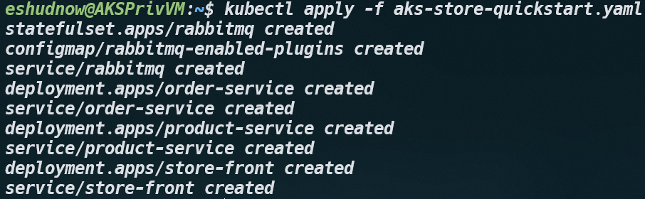

If we run the following command, it will allow us to validate our services and their Private IPs (Cluster IP) and we can validate the service is using an IP Address in our Service CIDR Range of 10.0.0/16

``` bash
kubectl get service
```


If we run the following command, it will allow us to validate our pods and their Private IPs belong to the Pod CIDR Network Prefix Range of 10.244.0.0/16

``` bash
kubectl get pod -o wide
```


It was mentioned in the introduction that for a CNI Overlay Cluster, each node carves out a /24 network prefix for the Pod CIDR which is why each node is allowed to support a max amount of 250 pods per node.  We just validated that the pods are all running on 10.244 which is part of the Pod CIDR Network Prefix.  But if you'd like to see what /24 Pod CIDR Prefix it has been carved out, you can run the following command:

Single Node (specify `<node name>`):
``` bash
kubectl -n kube-system get nnc <node name> -o jsonpath='{.metadata.name}{" -> PrimaryIP: "}{.status.networkContainers[0].primaryIP}{" | Subnet: "}{.status.networkContainers[0].subnetAddressSpace}{"\n"}'
```

After running the command to retrieve a specific node, the network prefix returned (PrimaryIP) is the /24 used by that node that falls within the Subnet field which is the entire Pod CIDR Network Prefix.

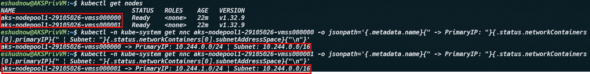


All Nodes (exclude `<node name>`):
``` bash
kubectl -n kube-system get nnc -o jsonpath='{range .items[*]}{.metadata.name}{"\t"}{.status.networkContainers[0].primaryIP}{"\t"}{.status.networkContainers[0].subnetAddressSpace}{"\n"}{end}'
```

After running the command to retrieve all nodes, the network prefix returned (PrimaryIP) is the /24 used by that node that falls within the Subnet field which is the entire Pod CIDR Network Prefix.

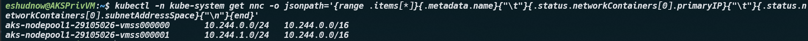

## Private API Connectivity Under the Hood using Managed Virtual Network and Managed Private DNS Zone
As mentioned, in this lab, we've deployed our AKS Cluster using a custom Virtual Network and a managed Private DNS Zone and Private Endpoint.  Let's take a look under the hood as to how our connectivity to the Private API Server is working.

Go back to the JSON View of our AKS Cluster.


Within the properties, there is both an fqdn and privateFQDN property.

```
"properties": {
        "provisioningState": "Succeeded",
        "powerState": {
            "code": "Running"
        },
        "kubernetesVersion": "1.32",
        "currentKubernetesVersion": "1.32.9",
        "dnsPrefix": "aks-cluste-rg-aks-cluster-1df8be",
        "fqdn": "aks-cluste-rg-aks-cluster-1df8be-okag7okj.hcp.centralus.azmk8s.io",
        "azurePortalFQDN": "7501329e84dfabdcd835bfd18e8296e7-priv.portal.hcp.centralus.azmk8s.io",
        "privateFQDN": "aks-cluste-rg-aks-cluster-1df8be-imb5zd8k.1c41352d-7472-4e38-ad12-d4d6c80eba70.privatelink.centralus.azmk8s.io",
```
The privateFQDN is: "<span style="color:green">aks-cluste-rg-aks-cluster-1df8be-imb5zd8k</span>.<span style="color:red">1c41352d-7472-4e38-ad12-d4d6c80eba70.privatelink.centralus.azmk8s.io</span>"

In our managed AKS Private DNS Zone, our Private DNS Zone is: <span style="color:red">1c41352d-7472-4e38-ad12-d4d6c80eba70.privatelink.centralus.azmk8s.io</span>.  Our A record for the Private Endpoint itself is <span style="color:green">aks-cluste-rg-aks-cluster-1df8be-imb5zd8k</span>.  I have color coded this for you to see how within the JSON View properties, the privateFQDN matches the Private DNS Zone and Private Endpoint together.


And remember when we get the AKS Credentials for an AKS Cluster, it tells us that the config has been written to /home/user/.kube/config.  :

``` bash
az aks get-credentials -g "$RG" -n "$AKS" --overwrite-existing
```

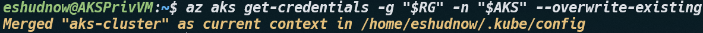

In our config file, the server that the az aks get-credentials provides us is the same privateFQDN we saw in our AKS Cluster's JSON View within the Azure Portal.  Because my VM is in the same Virtual Network (as mentioned earlier, there are several ways to connect to a Private AKS Cluster), we have access to the Private DNS Zone that is linked to our managed Virtual Network and therefore, have access to the Private DNS Zone, the Private Endpoint/NIC FQDN/IP Record, and can establish a connection to our API Server via our Private Endpoint.


## Disabling Public FQDN

As we saw earlier, our AKS Private Cluster has both fqdn and privateFQDN.  And our kube config file that is configured at /home/eshudnow/.kube/config contains the privateFQDN.

``` json
"properties": {
        "provisioningState": "Succeeded",
        "powerState": {
            "code": "Running"
        },
        "kubernetesVersion": "1.32",
        "currentKubernetesVersion": "1.32.9",
        "dnsPrefix": "aks-cluste-rg-aks-cluster-1df8be",
        "fqdn": "aks-cluste-rg-aks-cluster-1df8be-okag7okj.hcp.centralus.azmk8s.io",
        "azurePortalFQDN": "7501329e84dfabdcd835bfd18e8296e7-priv.portal.hcp.centralus.azmk8s.io",
        "privateFQDN": "aks-cluste-rg-aks-cluster-1df8be-imb5zd8k.1c41352d-7472-4e38-ad12-d4d6c80eba70.privatelink.centralus.azmk8s.io",
```

The question folks may have is, is the fqdn, which is our public FQDN still resolvable from the internet? Let's take a look...

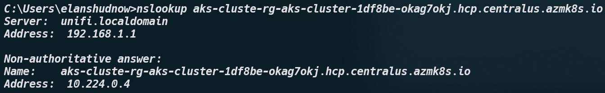

It certainly is... BUT... it provides back the private IP Address of our Private Endpoint.  Obviously, we can't connect to this over the internet.  But security may want to fully remove this FQDN from being resolved from the internet. In order to do so, we can run the following command:

``` bash
az aks update -g "$RG" -n "$AKS" --disable-public-fqdn
```

Upon completion of the provisioning, let's flush our client DNS cache and try the nslookup again.  This time, we will see our fqdn is not resolvable from the internet any longer.


